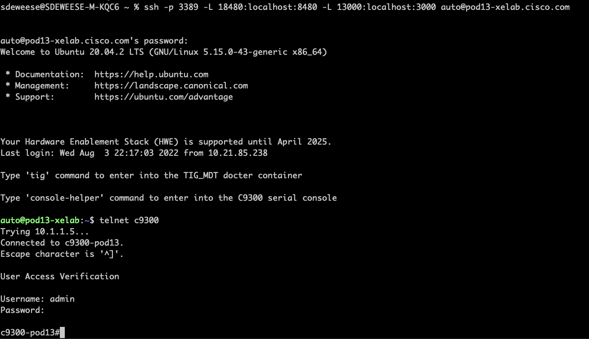
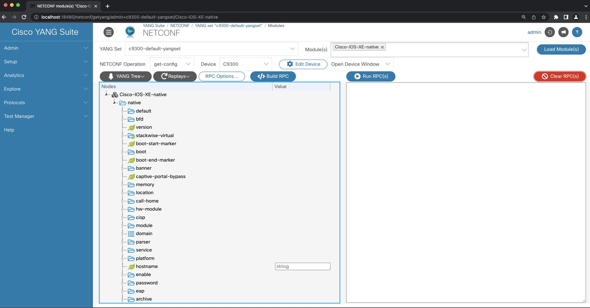
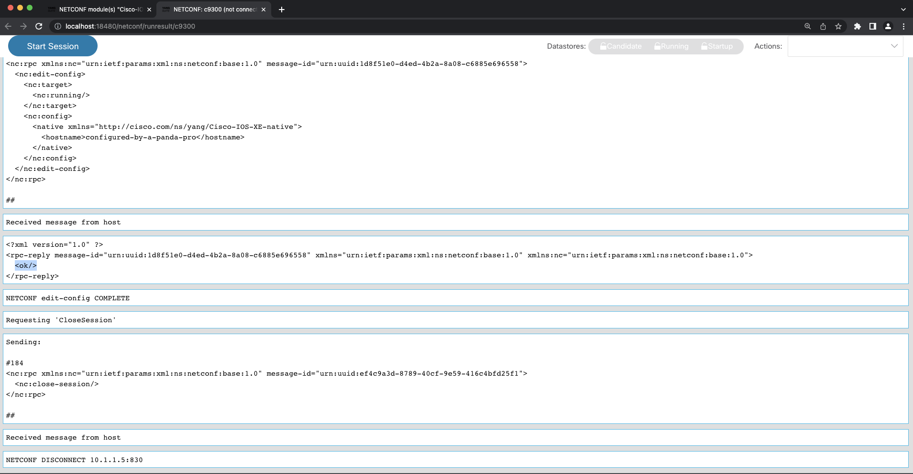

# YANG Suite
[YANG Suite](https://github.com/CiscoDevNet/yangsuite) is HTML5 based tooling that is available for working with the YANG based programmable interfaces on Cisco IOS XE, XR, and NX Network Operating Systems. It has plugins that allow for interacting with the programmable interfaces and supports downloading YANG files directly from network devices. In this module, we will explore using NETCONF and RESTCONF to configure a switch and we will create a gRPC telemetry subscriptions.

# Lab Overview

This lab has multiple sections:

1. NETCONF GET hostname config
1. NETCONF EDIT hostname
1. Verification

## Log in to 9300
Telnet into the Catalyst 9300 into the terminal window using credentials: admin / Cisco123

Notice the hostname is in the format "c9300-pod##" where the "##" represent your pod number.

## NETCONF: GET hostname  
Using NETCONF, make an API call to the C9300 device to determine the hostname.

1. Navigate to http://localhost:18480 in the browser. Note: Safari will not work because it uses HTTPS (rather than HTTP) by default.

1. Select the following in YANG Suite

    1. Protocol: “NETCONF”
    1. YANG Set: “c9300-default-yangset”
    1. Modules: “Cisco-IOS-XE-native” (note: start typing "native" to filter through the options in the dropdown menu)
    1. Click the blue “Load Modules” button
    1. NETCONF Operation: “get-config”
    1. Device: “c9300”
    1. Wait for the tree to appear in the grey box on the left. (note: if you get an Error 500 popup, just ignore it and close the popup.)
    1. Once the YANG tree is created, select "hostname" (note: select CONTROL + F or COMMAND + F to find "hostname" on the page)
    1. Select the word "hostname", but no need to add anything to the text box (leave it blank for the 'get' request)

The screen should look similar to below:

1. Click the blue "Build RPC" button to ***generate*** the XML RPC that is based on the YANG model and inputs provided. The XML can be reviewed, edited, or used in other tooling or orchestration systems as needed

1. Click the blue "Run RPC(s)" button to ***send*** the XML RPC to the switch's NETCONF Interface in order to retreive the config as requested

1. In the new tab that's opened, notice the hostname in the response. (note: you may need to scroll to the bottom of the page)

## NETCONF: EDIT hostname  
Using NETCONF, make an API call to the C9300 device to edit the hostname.

1. Select the following in YANG Suite

    1. Protocol: “NETCONF”
    1. YANG Set: “c9300-default-yangset”
    1. Modules: “Cisco-IOS-XE-native” (note: start typing "native" to filter through the options in the dropdown menu)
    1. Click the blue “Load Modules” button
    1. NETCONF Operation: “edit-config” **different than GET hostname above**
    1. Device: “c9300”
    1. Wait for the tree to appear in the grey box on the left. (note: if you get an Error 500 popup, just ignore it and close the popup.)
    1. Once the YANG tree is created, select "hostname" (note: select CONTROL + F or COMMAND + F to find "hostname" on the page)
    1. Select the word "hostname", and add a string to the text field such as "configured-by-a-panda-pro" **different than GET hostname above**
    1. Click the red "Clear RPCs" button for a fresh start **different than GET hostname above**

The screen should look similar to below:

1. Click the blue "Build RPC" button to ***generate*** the XML RPC that is based on the YANG model and inputs provided. The XML can be reviewed, edited, or used in other tooling or orchestration systems as needed

1. Click the blue "Run RPC(s)" button to ***send*** the XML RPC to the switch's NETCONF Interface in order to retreive the config as requested

1. In the new tab that's opened (note: you may need to close a previously opened tabs), notice the "ok" in the response indicating that the hostname was configured. (note: you may need to scroll to the bottom of the page)

## Verification
Return to the terminal press and the ENTER or RETURN key. Notice the hostname of the 9300 has changed. As the hostname says, you're now a panda pro!

